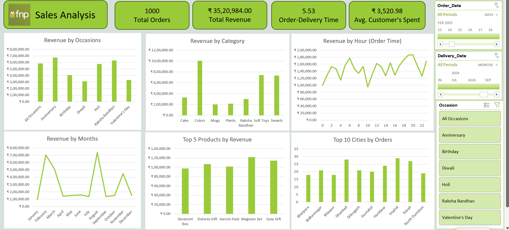

# 📊 Ferns and Petals Sales Analysis Dashboard

This project is an **Excel-based Sales Analysis Dashboard** created for **Ferns and Petals (FNP)**.  
It provides insights into sales trends, customer behavior, and product performance to help the company improve its sales strategy and optimize customer satisfaction.  

---

## 🚀 Problem Statement
Ferns and Petals specializes in sending gifts for various occasions like **Diwali, Raksha Bandhan, Holi, Valentine's Day, Birthdays, and Anniversaries**.  
The dataset contains details about products, orders, customers, and relevant dates.  

The goal of this project was to **analyze the dataset** and uncover insights related to:
- Revenue
- Customer spending
- Product performance
- Seasonal/Occasion-based trends
- Order & delivery performance

---

## 📌 Key Business Questions Answered
1. **Total Revenue** – Identify the overall revenue.  
2. **Average Order and Delivery Time** – Evaluate the time taken for orders to be delivered.  
3. **Monthly Sales Performance** – Examine how sales fluctuate across the months of 2023.  
4. **Top Products by Revenue** – Determine which products are the top revenue generators.  
5. **Customer Spending Analysis** – Understand how much customers spend on average.  
6. **Sales Performance of Top 5 Products** – Track revenue contribution from the best-selling products.  
7. **Top 10 Cities by Orders** – Find out which cities generate the most orders.  
8. **Order Quantity vs. Delivery Time** – Analyze if higher order quantities impact delivery times.  
9. **Revenue by Occasions** – Compare revenue generated across different occasions.  
10. **Product Popularity by Occasion** – Identify the most popular products for each occasion.  

---

## 🛠 Tools & Techniques Used
- **Microsoft Excel**
  - Power Query Editor (for data cleaning & transformation)  
  - Pivot Tables (for data aggregation)  
  - Interactive Charts & Slicers (for visualization)  
- **Dataset:** Sales data from FNP (Orders, Products, Customers, Dates)

---

## 📷 Dashboard Preview

---

## 🎯 Insights
- **Anniversary & Raksha Bandhan** were the highest revenue-generating occasions.  
- **Colors** category had the maximum sales among all product categories.  
- Peak sales occurred in **March** and **August**.  
- Average customer spent **₹3,520.98 per order**.  
- **Top cities** like Dhanbad, Imphal, and Kavali placed the highest number of orders.  

---

## 📺 Reference
This dashboard was created after following concepts from this YouTube video tutorial:  
[Excel Sales Dashboard Tutorial](https://youtu.be/Wom-eVrE4RY?si=eFTUlSw6E60ulyIH)  

---
